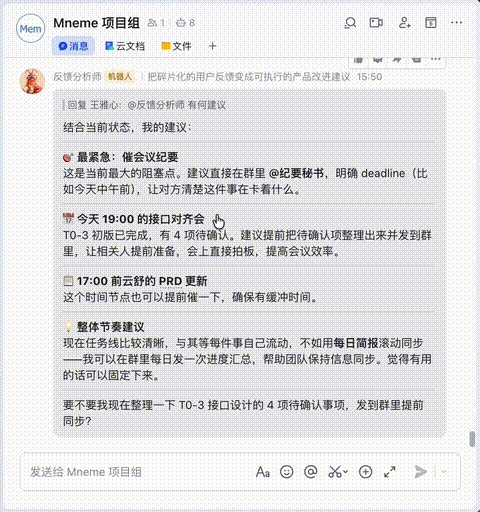
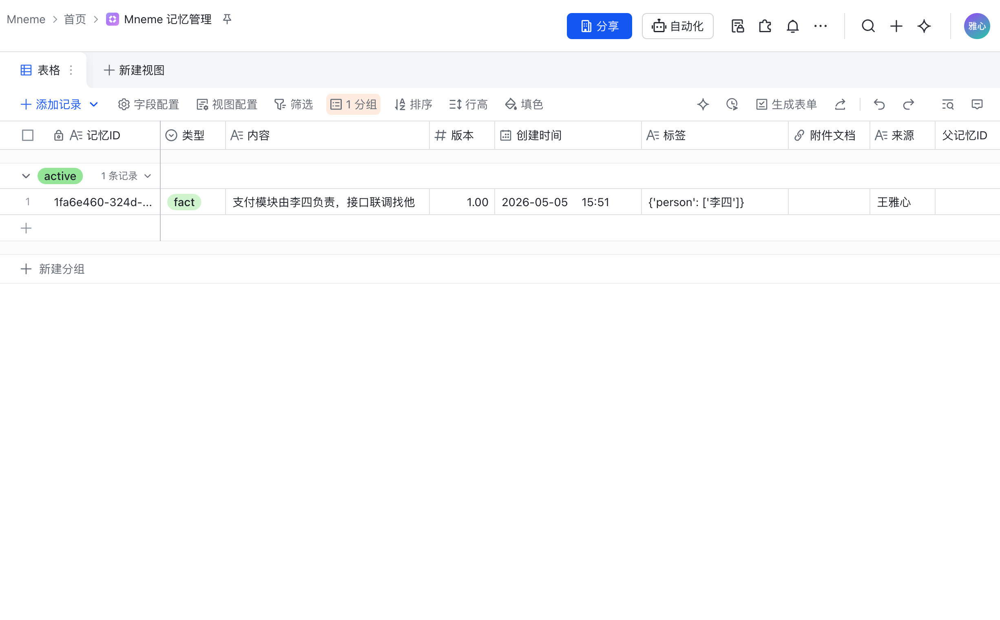
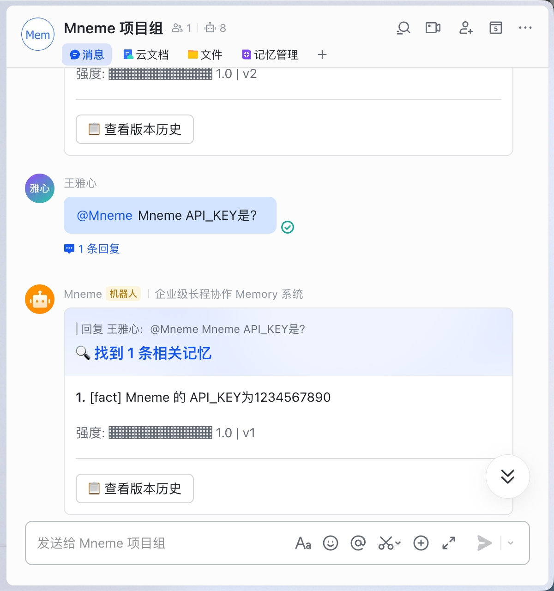
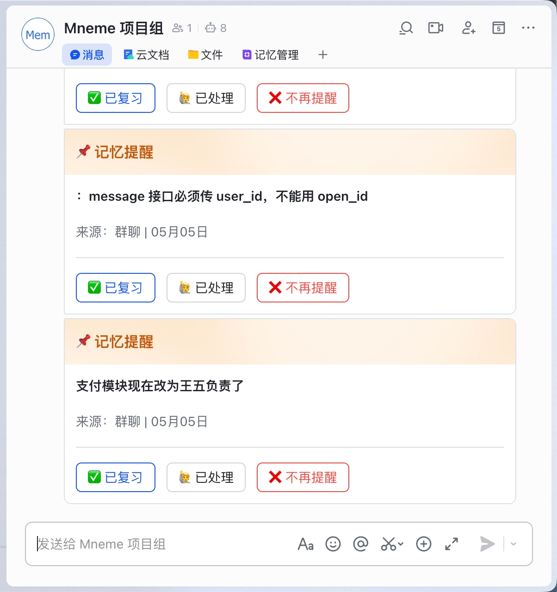
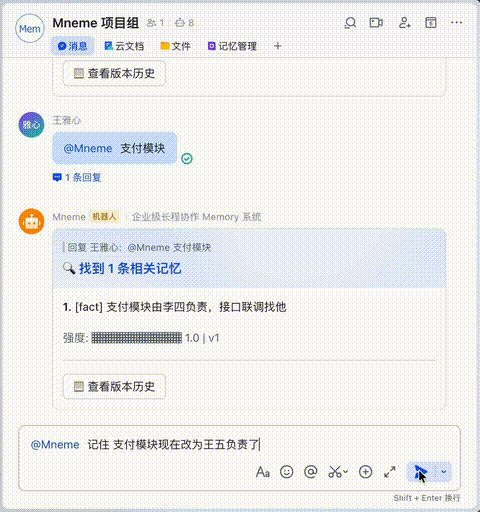
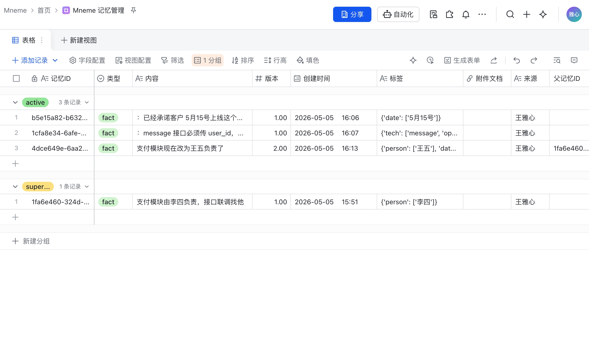
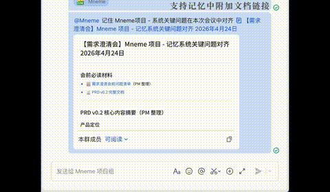
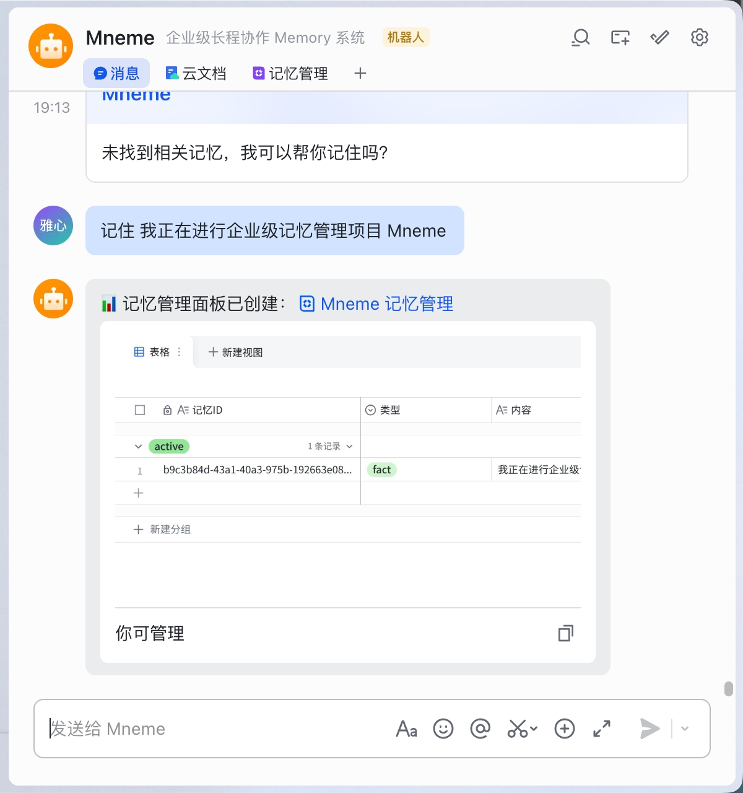
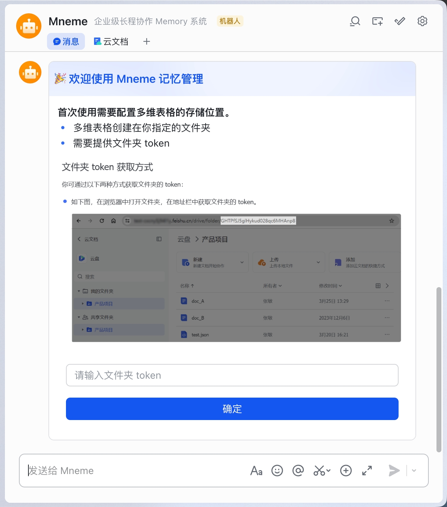

<div align="center">

# Mneme

企业级飞书协作记忆系统

基于艾宾浩斯遗忘曲线，自动提取、存储并主动推送团队关键信息

[](https://www.python.org/downloads/)
[](https://fastapi.tiangolo.com/)
[](https://www.postgresql.org/)
[](LICENSE)

[功能特性](#功能特性) · [快速开始](#快速开始) · [API 文档](#api-文档) · [🚧 🏗️](#功能建设中)

</div>

---

## 功能特性

### 1. 记忆创建

在飞书群聊中可通过 @Bot 的方式，触发记忆创建。首次记忆创建会自动弹出创建文档，并自动置顶为标签页。bot接收到记忆指令，并成功记忆时将以 “DONE” 表情回复。所有记忆以多维表格形式展示，自动按照活跃 / 非活跃记忆分类，一目了然。





### 2. 查询记忆

通过 @Bot 自然语言交互检索记忆。



### 3. 遗忘曲线主动推送

基于艾宾浩斯遗忘曲线模型，在记忆衰减临界点主动推送复习提醒卡片，确保关键信息不被遗忘。



### 4. 自动更新与记忆链

当同主题信息发生变更时，自动检测冲突并生成记忆链，保留完整的演进历史，杜绝信息过时。





### 5. 记忆附件链接

支持为记忆附加飞书文档、电子表格等链接，快速回溯到原始上下文。



### 6. 记忆租户分隔

不同群组 / 个人的记忆数据隔离，支持多租户独立管理。个人记忆存储通过与 Bot 私聊触发。



---

## 快速开始

### 环境要求

- Python >= 3.11
- PostgreSQL 15+
- Docker & Docker Compose（可选，推荐用于快速部署）

### 方式一：Docker 部署（推荐）

1. **克隆项目**

```bash
git clone https://github.com/999Async/Mneme.git
cd Mneme
```

2. **配置环境变量**

```bash
cp .env.example .env
```

编辑 `.env` 文件，填入飞书应用凭证和服务认证 Token：

```env
FEISHU_APP_ID=cli_xxxxxx
FEISHU_APP_SECRET=xxxxxx
```

3. **启动服务**

```bash
docker compose up --build
```

服务将在 `http://localhost:3001` 启动，PostgreSQL 在 `localhost:5432`。

4. 飞书应用配置

需要登陆[飞书开发者平台](https://open.feishu.cn/app?lang=zh-CN)，创建企业自建应用，配置机器人。

1. **权限与管理**：开启以下权限
```
- contact:contact.base:readonly
- 消息与群组
- 多维表格
- 卡片
```

2. **事件与回调**：


```
事件
- im.message.message_read_v1
- im.message.reaction.created_v1
- im.message.reaction.deleted_v1
- im.message.receive_v1

回调
- card.action.trigger
```

### 方式二：本地开发

1. **克隆并进入项目**

```bash
git clone https://github.com/999Async/Mneme.git
cd Mneme
```

2. **创建虚拟环境并安装依赖**

```bash
python -m venv .venv
source .venv/bin/activate
pip install -e ".[dev]"
```

3. **配置环境变量**

```bash
cp .env.example .env
# 编辑 .env 填入实际配置
```

4. **确保 PostgreSQL 已运行**，创建数据库：

```bash
createdb -U postgres mneme
# 或使用 psql:
# CREATE DATABASE mneme;
```

6. **启动开发服务器**

```bash
uvicorn app.main:app --reload --host 0.0.0.0 --port 3001
```

启动后访问：
- Swagger UI：http://localhost:3001/docs
- ReDoc：http://localhost:3001/redoc

---

## API 文档

### 核心接口

| 方法 | 路径 | 说明 |
|------|------|------|
| `POST` | `/api/memories` | 创建记忆 |
| `GET` | `/api/memories` | 查询记忆（三路召回） |
| `GET` | `/api/memories/:id` | 获取记忆详情 |
| `POST` | `/api/memories/:id/review` | 复习 / 强化记忆 |
| `POST` | `/api/memories/conflicts/detect` | 冲突检测 |
| `POST` | `/api/context-snapshots` | 保存上下文快照 |
| `POST` | `/api/cron/decay` | 遗忘曲线衰减扫描 |
| `POST` | `/api/cron/push-l1` | L1 推送执行 |

### 认证方式

所有接口通过 `Authorization: Bearer <token>` 进行认证，并通过 `X-Idempotency-Key` 请求头保证幂等性。

> 完整接口设计请参阅 [接口设计文档](docs/Mneme%20接口设计文档%20-%20OpenClaw%20×%20PostgreSQL.md)。

---

## 技术栈

| 类别 | 技术 |
|------|------|
| Web 框架 | FastAPI + Uvicorn |
| 数据库 | PostgreSQL 15 + asyncpg |
| ORM | SQLAlchemy 2.0 (async) |
| 数据校验 | Pydantic v2 |
| 数据库迁移 | Alembic |
| HTTP 客户端 | httpx |
| 容器化 | Docker + Docker Compose |
| 测试 | pytest + pytest-asyncio |

---

## 功能（建设中...）

### 1. 自定义记忆多维表格存放

初次创建多维表格时支持通过卡片交互的方式，用户自行配置文档存放位置



### 2. 通过卡片交互动态改变遗忘提醒频率

通过卡片交互改变遗忘提醒频率，更加智能，符合人的遗忘规律。


### 3. Proactive 记忆提醒机制

监测到群聊中对于记忆召回的需求，主动式补充相关记忆信息。

### 4. 更丰富的交互方式与记忆展示方式

多维表格的多种视图展示方式，卡片交互在记忆 CRUD 中的使用...


---
## License

[MIT](LICENSE) © 2026 999Async
